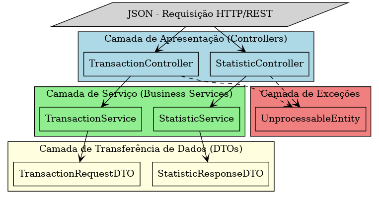
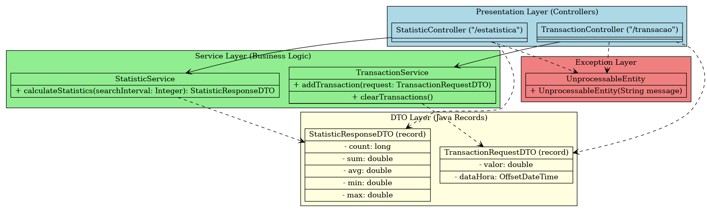
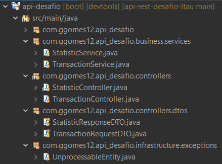

## Transaction API 

Resolution of the Itaú Unibanco Programming Challenge.

You can access the GitHub repository for this project here:
[desafio-Itau](https://github.com/rafaellins-itau/desafio-itau-vaga-99-junior)

---

This is a REST API for managing transactions and generating statistics.

---

### Architecture Diagram

The project follows a layered architecture pattern, which helps in maintaining a clean separation of concerns. This ensures modularity, scalability, and ease of maintenance. The main layers include:

- **Presentation Layer**: Handles HTTP requests and responses, acting as the entry point for the API.
- **Service Layer**: Implements business logic and processes data before passing it between the controller and the data layers.
- **Data Transfer Objects (DTOs)**: Defines structured objects to encapsulate data being sent and received.
- **Exception Handling Layer**: Centralized handling of application exceptions to ensure consistent error responses.




---

### Detailed Architecture


This diagram provides a more detailed view of the project structure, highlighting dependencies between components and services.



---

## Technologies Used

- Java 23
- Spring Boot 3
- Maven
- Lombok
- Swagger (OpenAPI)


---

## Project Structure



---

## API Endpoints

### Transaction Controller (`/transacao`)

#### **Add Transaction**
```http
POST /transacao
```
**Request Body:**
```json
{
  "valor": 100.50,
  "dataHora": "2024-01-30T10:15:30Z"
}
```
**Responses:**
- `201 Created` - Transaction added successfully
- `204 No Content` - Transaction older than 60 seconds
- `400 Bad Request` - Invalid transaction data
- `422 Unprocessable Entity` - Future transaction timestamp
- `500 Internal Server Error` - Internal API error

#### **Clear Transactions**
```http
DELETE /transacao
```
**Responses:**
- `200 OK` - Transactions cleared
- `500 Internal Server Error` - Internal API error

### Statistics Controller (`/estatistica`)

#### **Get Statistics**
```http
GET /estatistica?searchInterval=60
```
**Response:**
```json
{
  "count": 5,
  "sum": 500.0,
  "avg": 100.0,
  "min": 50.0,
  "max": 150.0
}
```
**Responses:**
- `200 OK` - Statistics retrieved
- `400 Bad Request` - Invalid search interval
- `500 Internal Server Error` - Internal API error

---

## Running the Application

### Prerequisites
Ensure you have the following installed:
- Java 23
- Maven
- Lombok

### Build and Run
```sh
mvn clean install
mvn spring-boot:run
```

The application will start on `http://localhost:8080`.

---

## Swagger Documentation

The API documentation is available at:
```html
<a href="http://localhost:8080/swagger-ui.html">Swagger UI</a>
```


